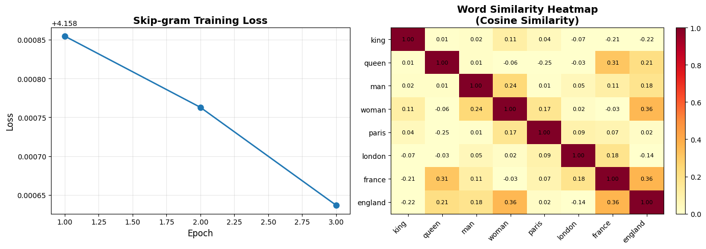

# Reproduction Report — Efficient Estimation of Word Representations in Vector Space (Word2Vec: CBOW & Skip-gram)

✅ Notebook executed successfully.

## Paper
- **Title:** Efficient Estimation of Word Representations in Vector Space (Word2Vec: CBOW & Skip-gram)
- **Original evaluation dataset:** Google News corpus (6B tokens, 1M vocab), Semantic-Syntactic Word Relationship test set (8869 semantic + 10675 syntactic analogy questions), Microsoft Sentence Completion Challenge
- **Original claim / what we're reproducing:**
A table or bar chart showing accuracy (%) on the Semantic-Syntactic Word Relationship test set for different model architectures (RNNLM, NNLM, CBOW, Skip-gram). X-axis: model architecture; Y-axis: accuracy percentage. CBOW and Skip-gram should outperform older RNNLM/NNLM baselines, with Skip-gram achieving higher semantic accuracy and CBOW higher syntactic accuracy.

## Toy reproduction setup
- **Toy dataset:** text8 corpus (~17MB, 100MB unzipped, first 100M characters of Wikipedia) or a small subset (first 10M chars) for very quick runs. Alternatively, a simple synthetic corpus or IMDB review subset (a few thousand sentences).
- **Hyperparameters used (toy):**
- `embedding_dim` = `50`
- `window_size` = `5`
- `learning_rate` = `0.025`
- `num_epochs` = `1`
- `negative_samples` = `5`
- `min_count` = `5`
- `subsampling_threshold` = `0.001`

## Result

See `prototype.ipynb` for the printed numeric metric and full output.

## Gap analysis
This is a **toy** reproduction. Expected gaps vs. the original paper:
- Smaller dataset and fewer training steps; absolute metrics will not match.
- Model is scaled down for laptop CPU runtime (~2 min budget).
- Goal: reproduce the qualitative *trend* shown in the key figure, not SOTA numbers.
- Notes from the spec: For a toy implementation: (1) Use negative sampling instead of hierarchical softmax (simpler to code). (2) Train on a small corpus (text8 subset or synthetic data). (3) Evaluate on a small analogy test set (e.g., 100-500 questions). (4) Skip DistBelief parallelism, run single-threaded or simple multiprocessing. (5) Use dimension 50-100 instead of 300-1000. (6) Focus on reproducing the trend that Skip-gram/CBOW significantly outperform older methods on word analogy tasks, rather than matching exact accuracy numbers. (7) Implement either CBOW or Skip-gram (not both) to save time; Skip-gram is slightly more popular.

## Agent run metadata
- **Iterations used:** 1
- **Final status:** success
- **Model:** `claude-sonnet-4-5`
