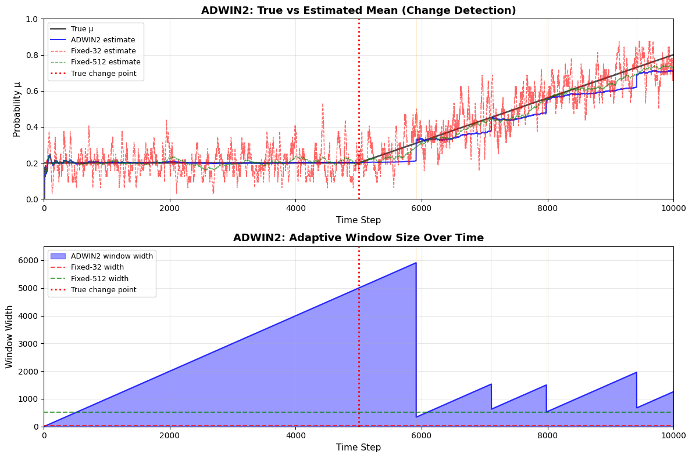

# Reproduction Report — Learning from Time-Changing Data with Adaptive Windowing (ADWIN2)

✅ Notebook executed successfully.

## Paper
- **Title:** Learning from Time-Changing Data with Adaptive Windowing (ADWIN2)
- **Original evaluation dataset:** Synthetic Bernoulli streams with changing probability μ_t (abrupt and gradual changes); Rotating hyperplane concept drift; Electricity Market Dataset (NSW, 45312 instances)
- **Original claim / what we're reproducing:**
Time series plot with two y-axes: Left axis shows true μ_t (step line) and estimated μ_W (smooth line) ranging 0-1; Right axis shows window width W (shaded area) ranging 0-2500. X-axis is time t from 0 to 3000. Shows window growing linearly during stable period, sharp drop when change occurs around t=1000, then growing again. Demonstrates adaptive window shrinking at change point.

## Toy reproduction setup
- **Toy dataset:** Synthetic Bernoulli bit stream of 10,000 samples with μ=0.2 for first 5,000 steps, then linear increase to μ=0.8 over next 5,000 steps
- **Hyperparameters used (toy):**
- `delta` = `0.002`
- `M` = `5`

## Result

See `prototype.ipynb` for the printed numeric metric and full output.

## Gap analysis
This is a **toy** reproduction. Expected gaps vs. the original paper:
- Smaller dataset and fewer training steps; absolute metrics will not match.
- Model is scaled down for laptop CPU runtime (~2 min budget).
- Goal: reproduce the qualitative *trend* shown in the key figure, not SOTA numbers.
- Notes from the spec: Simplifications for toy version: 1) Use the normal approximation for ε_cut in Eq 3.1 instead of pure Hoeffding bound for better sensitivity. 2) Focus on detecting changes in Bernoulli probability (boolean case) rather than real-valued streams. 3) Skip the Na¨ıve Bayes and k-means integration; just evaluate ADWIN2 as a change detector/estimator. 4) Compare to 2-3 fixed window sizes (e.g., 32, 512) instead of full range. 5) Measure: false positive rate when no change, detection delay when change occurs, and mean squared error of μ_W estimate. 6) Use M=5 buckets per size as in paper. 7) Skip flushing window variants to simplify comparison.

## Agent run metadata
| Field | Value |
|---|---|
| Status | success |
| Iterations used | 1 |
| Succeeded on iteration **1** of 1. | |
| Wall-clock time | 106.6s |
| Total tokens | 30115 |
| Input tokens | 25033 |
| Output tokens | 5082 |
| Model | `claude-sonnet-4-5` |

### Auto-install log
- No packages were auto-installed during the run.
