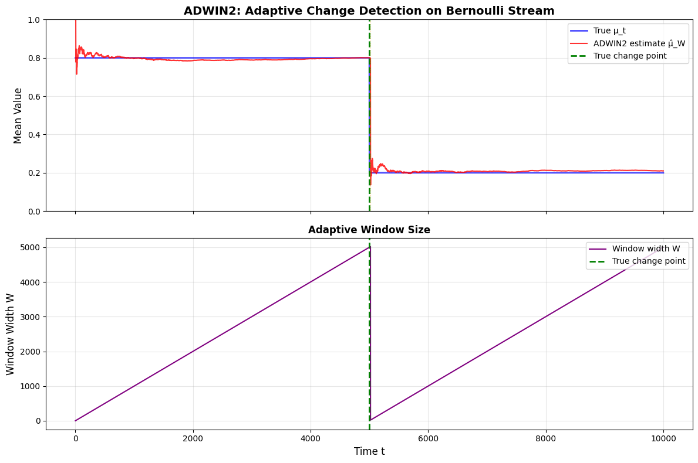

# Reproduction Report — ADWIN2: Adaptive Windowing for Learning from Time-Changing Data

✅ Notebook executed successfully.

## Paper
- **Title:** ADWIN2: Adaptive Windowing for Learning from Time-Changing Data
- **Original evaluation dataset:** 1) Synthetic Bernoulli streams with changing probability μ_t (abrupt and gradual drift); 2) Rotating hyperplane synthetic data (d=8 dimensions); 3) Australian New South Wales Electricity Market dataset (ELEC2, 45,312 instances)
- **Original claim / what we're reproducing:**
Figure 2 (abrupt change): X-axis is time t (0 to 3000), left Y-axis shows true μ_t (step function: 0.8 dropping to 0.4 at t=1000) and estimated μ̂_W (tracking closely), right Y-axis shows window width W (grows linearly until t=1000, shrinks sharply at change detection ~t=1010, then grows again). Key result: ADWIN2 detects change within ~10 steps and adjusts window automatically.

## Toy reproduction setup
- **Toy dataset:** Generate 10,000 samples from Bernoulli(μ_t) where μ_t = 0.8 for t ∈ [1,5000], then abruptly changes to μ_t = 0.2 for t ∈ [5001,10000]. Alternative: linear drift from 0.8 to 0.2 over 2000 steps. For real values: Gaussian N(μ_t, 0.1) with similar drift.
- **Hyperparameters used (toy):**
- `delta` = `0.002`
- `M` = `5`

## Result

See `prototype.ipynb` for the printed numeric metric and full output.

## Gap analysis
This is a **toy** reproduction. Expected gaps vs. the original paper:
- Smaller dataset and fewer training steps; absolute metrics will not match.
- Model is scaled down for laptop CPU runtime (~2 min budget).
- Goal: reproduce the qualitative *trend* shown in the key figure, not SOTA numbers.
- Notes from the spec: For toy version: 1) Use M=5 buckets as in paper; 2) Skip the more complex δ' = δ/ln(n) adjustment, just use δ'=δ/n for simplicity; 3) Focus on binary/Bernoulli case first (simpler than real-valued); 4) Compare to fixed-size windows (W=32, 128, 512) to show ADWIN2 adapts better; 5) Skip the Naïve Bayes and k-means integration initially, just demonstrate the core change detection on synthetic streams; 6) For visualization, plot μ_t (true), μ̂_W (estimated), and W (window size) over time as in Figures 2-3

## Agent run metadata
| Field | Value |
|---|---|
| Status | success |
| Iterations used | 1 |
| Succeeded on iteration **1** of 1. | |
| Wall-clock time | 93.2s |
| Total tokens | 29830 |
| Input tokens | 25232 |
| Output tokens | 4598 |
| Model | `claude-sonnet-4-5` |

### Auto-install log
- No packages were auto-installed during the run.
