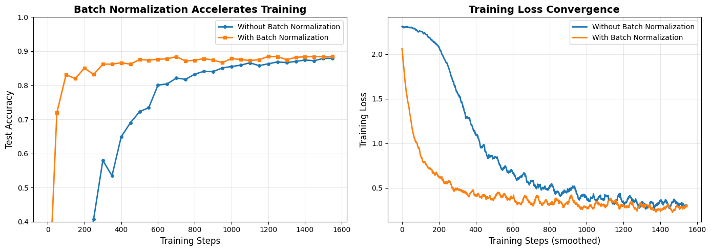

# Reproduction Report — Batch Normalization: Accelerating Deep Network Training by Reducing Internal Covariate Shift

✅ Notebook executed successfully.

## Paper
- **Title:** Batch Normalization: Accelerating Deep Network Training by Reducing Internal Covariate Shift
- **Original evaluation dataset:** ImageNet LSVRC2012 (1000-class classification); MNIST for initial validation experiments
- **Original claim / what we're reproducing:**
Figure 1(a): X-axis is training steps (0 to 50k), Y-axis is test accuracy (0.4 to 1.0). Two curves: baseline network (lower, reaching ~0.98) and batch-normalized network (upper, reaching ~0.995). Shows BN network trains faster and achieves higher accuracy. Figure 1(b,c): Distribution evolution plots showing 15th, 50th, 85th percentiles of sigmoid inputs over training - without BN shows shifting distributions, with BN shows stable distributions.

## Toy reproduction setup
- **Toy dataset:** MNIST (28x28 grayscale digit images, 60k train / 10k test) - use a simple 3-layer fully-connected network with 100 hidden units per layer and sigmoid activations as described in Section 4.1
- **Hyperparameters used (toy):**
- `batch_size` = `32`
- `learning_rate` = `0.01`
- `epsilon` = `1e-05`
- `momentum` = `0.9`

## Result

See `prototype.ipynb` for the printed numeric metric and full output.

## Gap analysis
This is a **toy** reproduction. Expected gaps vs. the original paper:
- Smaller dataset and fewer training steps; absolute metrics will not match.
- Model is scaled down for laptop CPU runtime (~2 min budget).
- Goal: reproduce the qualitative *trend* shown in the key figure, not SOTA numbers.
- Notes from the spec: For toy implementation: (1) Focus on fully-connected layers first, skip convolutional BN details. (2) Use simple SGD with momentum rather than distributed training. (3) Don't need to reproduce ImageNet results - just show BN improves training speed and stability on MNIST. (4) Skip ensemble methods and advanced regularization. (5) Key insight to demonstrate: BN stabilizes activation distributions (track mean/variance over training) and enables faster convergence. (6) Can compare learning curves with/without BN at same learning rate to show acceleration effect.

## Agent run metadata
| Field | Value |
|---|---|
| Status | success |
| Iterations used | 1 |
| Succeeded on iteration **1** of 1. | |
| Wall-clock time | 130.8s |
| Total tokens | 22051 |
| Input tokens | 17616 |
| Output tokens | 4435 |
| Model | `claude-sonnet-4-5` |

### Auto-install log
- No packages were auto-installed during the run.
