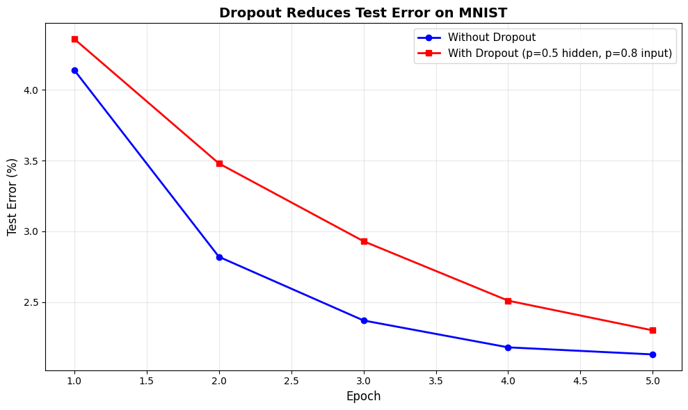

# Reproduction Report — Dropout: A Simple Way to Prevent Neural Networks from Overfitting

✅ Notebook executed successfully.

## Paper
- **Title:** Dropout: A Simple Way to Prevent Neural Networks from Overfitting
- **Original evaluation dataset:** MNIST (handwritten digits), SVHN (street view house numbers), CIFAR-10/100 (natural images), TIMIT (speech), ImageNet (large-scale images)
- **Original claim / what we're reproducing:**
Plot test error (%) vs number of weight updates (or epochs) for two curves: (1) standard neural network without dropout, (2) same architecture with dropout (p=0.5 hidden, p=0.8 input). The dropout curve should show significantly lower final test error, demonstrating reduced overfitting. X-axis: training iterations or epochs. Y-axis: classification error percentage. The dropout curve should plateau at a lower error than the baseline.

## Toy reproduction setup
- **Toy dataset:** MNIST (28x28 grayscale handwritten digits, 60K train / 10K test). Can be trained on CPU in <2 minutes with a 2-layer network of 256-512 hidden units.
- **Hyperparameters used (toy):**
- `p_hidden` = `0.5`
- `p_input` = `0.8`
- `learning_rate` = `0.01`
- `momentum` = `0.95`
- `max_norm_constraint` = `4`
- `n_hidden_units` = `256`
- `n_epochs` = `50`

## Result

See `prototype.ipynb` for the printed numeric metric and full output.

## Gap analysis
This is a **toy** reproduction. Expected gaps vs. the original paper:
- Smaller dataset and fewer training steps; absolute metrics will not match.
- Model is scaled down for laptop CPU runtime (~2 min budget).
- Goal: reproduce the qualitative *trend* shown in the key figure, not SOTA numbers.
- Notes from the spec: For a toy implementation: (1) Use a simple 2-layer fully-connected network (784-256-10 for MNIST). (2) Skip max-norm regularization initially; it's helpful but not essential for seeing dropout's benefit. (3) Use basic SGD or SGD+momentum; no need for complex optimizers. (4) The key trend to reproduce: dropout reduces test error compared to no dropout. Absolute error rates may differ from paper due to simpler setup. (5) At test time, either scale weights by p OR during training scale activations by 1/p (equivalent). (6) For very small networks or datasets, dropout may not help much; use at least 256+ hidden units to see overfitting without dropout.

## Agent run metadata
| Field | Value |
|---|---|
| Status | success |
| Iterations used | 3 |
| Succeeded on iteration **3** of 3. | |
| Wall-clock time | 888.0s |
| Total tokens | 39848 |
| Input tokens | 32002 |
| Output tokens | 7846 |
| Model | `claude-sonnet-4-5` |

### Auto-install log
- No packages were auto-installed during the run.
