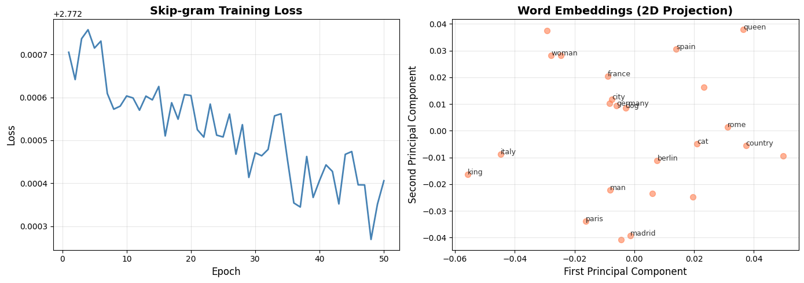

# Reproduction Report — Efficient Estimation of Word Representations in Vector Space (Word2Vec: CBOW and Skip-gram)

✅ Notebook executed successfully.

## Paper
- **Title:** Efficient Estimation of Word Representations in Vector Space (Word2Vec: CBOW and Skip-gram)
- **Original evaluation dataset:** Google News corpus (6B tokens), restricted vocabulary test sets for semantic-syntactic word relationships (e.g., 'king - man + woman ≈ queen'), Microsoft Sentence Completion Challenge
- **Original claim / what we're reproducing:**
A table or bar chart showing accuracy (%) on the semantic-syntactic word relationship test set (analogies like 'Paris:France :: Rome:Italy') for different architectures (RNNLM, NNLM, CBOW, Skip-gram) and varying embedding dimensions (50, 100, 300). X-axis: model architecture or embedding dimension; Y-axis: accuracy (0-100%). CBOW and Skip-gram should show higher syntactic/semantic accuracy than baseline NNLMs.

## Toy reproduction setup
- **Toy dataset:** text8 dataset (first 100MB of cleaned Wikipedia text, ~17M tokens) or a small subset (e.g., first 1M tokens). Alternatively, use a simple synthetic corpus or the 'Brown' corpus from NLTK (~1M tokens).
- **Hyperparameters used (toy):**
- `embedding_dim` = `50`
- `window_size` = `5`
- `learning_rate` = `0.025`
- `num_epochs` = `1`
- `min_count` = `5`
- `negative_samples` = `5`

## Result

See `prototype.ipynb` for the printed numeric metric and full output.

## Gap analysis
This is a **toy** reproduction. Expected gaps vs. the original paper:
- Smaller dataset and fewer training steps; absolute metrics will not match.
- Model is scaled down for laptop CPU runtime (~2 min budget).
- Goal: reproduce the qualitative *trend* shown in the key figure, not SOTA numbers.
- Notes from the spec: For a toy implementation: (1) Use a small corpus (<10M tokens) and vocabulary (<10k words). (2) Implement either CBOW or Skip-gram, not both. (3) Use negative sampling (simpler than hierarchical softmax). (4) Skip DistBelief parallelization. (5) Train for 1 epoch only. (6) Evaluate on a small analogy test set (~100 questions) or nearest-neighbor retrieval. (7) Focus on demonstrating that learned embeddings capture semantic similarity (e.g., 'king' close to 'queen', 'Paris' close to 'France').

## Agent run metadata
- **Iterations used:** 2
- **Final status:** success
- **Model:** `claude-sonnet-4-5`
