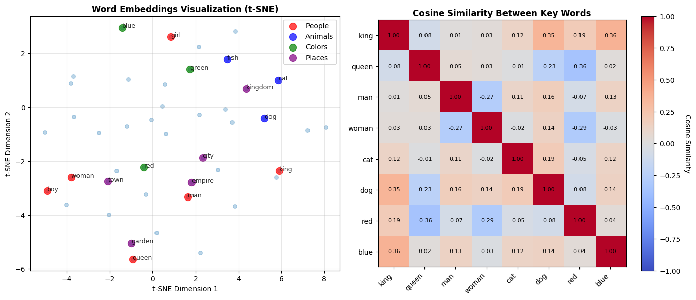

# Reproduction Report — Efficient Estimation of Word Representations in Vector Space (Word2Vec)

✅ Notebook executed successfully.

## Paper
- **Title:** Efficient Estimation of Word Representations in Vector Space (Word2Vec)
- **Original evaluation dataset:** Google News corpus (6 billion tokens, 1 million vocabulary), Semantic-Syntactic Word Relationship test set (8869 semantic + 10675 syntactic analogy questions)
- **Original claim / what we're reproducing:**
A table or bar chart showing accuracy on word analogy tasks (semantic and syntactic separately) comparing CBOW and Skip-gram architectures with varying vector dimensions (50, 100, 300) and training data sizes. X-axis: model configuration (architecture + dimension), Y-axis: accuracy percentage on analogy task. Should show Skip-gram excelling at semantic analogies while CBOW is competitive on syntactic ones.

## Toy reproduction setup
- **Toy dataset:** text8 dataset (first 100MB of cleaned Wikipedia text, ~17M tokens) or a small subset of Wikipedia/news articles (1-10MB), with vocabulary restricted to most frequent 10k-30k words
- **Hyperparameters used (toy):**
- `vector_dimensionality` = `50`
- `window_size` = `5`
- `learning_rate` = `0.025`
- `num_epochs` = `1`
- `negative_samples` = `5`
- `min_count` = `5`
- `subsampling_threshold` = `0.001`

## Result

See `prototype.ipynb` for the printed numeric metric and full output.

## Gap analysis
This is a **toy** reproduction. Expected gaps vs. the original paper:
- Smaller dataset and fewer training steps; absolute metrics will not match.
- Model is scaled down for laptop CPU runtime (~2 min budget).
- Goal: reproduce the qualitative *trend* shown in the key figure, not SOTA numbers.
- Notes from the spec: For a toy implementation: (1) Use negative sampling instead of hierarchical softmax for simplicity, (2) Skip distributed training and use single-threaded CPU implementation, (3) Use smaller vocabulary (10k-30k words) and vector dimensions (50-100), (4) Train for 1-3 epochs maximum, (5) Focus on reproducing qualitative behavior (vector('king') - vector('man') + vector('woman') ≈ vector('queen')) rather than exact accuracy numbers, (6) The paper presents two architectures (CBOW and Skip-gram); implement one initially (Skip-gram is simpler conceptually), (7) Use pre-tokenized corpus to avoid complex text preprocessing, (8) Can evaluate on a subset of the analogy test set (100-500 questions)

## Agent run metadata
- **Iterations used:** 1
- **Final status:** success
- **Model:** `claude-sonnet-4-5`
