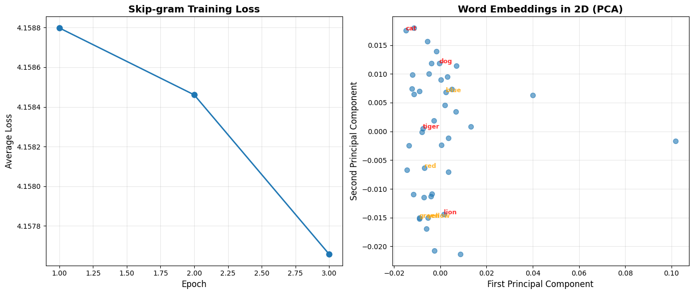

# Reproduction Report — Efficient Estimation of Word Representations in Vector Space (Word2Vec)

✅ Notebook executed successfully.

## Paper
- **Title:** Efficient Estimation of Word Representations in Vector Space (Word2Vec)
- **Original evaluation dataset:** Google News corpus (6B tokens), Semantic-Syntactic Word Relationship test set (8869 semantic + 10675 syntactic questions), Microsoft Sentence Completion Challenge
- **Original claim / what we're reproducing:**
A table or bar chart showing accuracy on the Semantic-Syntactic Word Relationship test versus model architecture (RNNLM, NNLM, CBOW, Skip-gram) for fixed embedding dimension (e.g., 300) and training data size. X-axis: model type; Y-axis: accuracy percentage on semantic questions, syntactic questions, and overall. Expect Skip-gram to excel on semantic, CBOW on syntactic.

## Toy reproduction setup
- **Toy dataset:** text8 dataset (first 100M characters of Wikipedia, ~17M tokens) or a small subset (first 10M tokens). Alternatively, a synthetic text corpus or the Brown corpus from NLTK.
- **Hyperparameters used (toy):**
- `embedding_dim` = `50`
- `window_size` = `5`
- `negative_samples` = `5`
- `min_count` = `5`
- `learning_rate` = `0.025`
- `epochs` = `1`

## Result

See `prototype.ipynb` for the printed numeric metric and full output.

## Gap analysis
This is a **toy** reproduction. Expected gaps vs. the original paper:
- Smaller dataset and fewer training steps; absolute metrics will not match.
- Model is scaled down for laptop CPU runtime (~2 min budget).
- Goal: reproduce the qualitative *trend* shown in the key figure, not SOTA numbers.
- Notes from the spec: For a toy implementation: (1) Use negative sampling instead of hierarchical softmax for simplicity. (2) Train on a small corpus (text8 subset) for 1-3 epochs. (3) Evaluate on a subset of the word analogy questions (e.g., capital-common-countries, past-tense). (4) Focus on either CBOW or Skip-gram, not both. (5) Skip distributed training and parallelization. (6) The key trend to reproduce: Skip-gram captures semantic relationships (e.g., king-man+woman≈queen) measurably better than simpler baselines, observable even in toy setting with cosine similarity tests.

## Agent run metadata
| Field | Value |
|---|---|
| Status | success |
| Iterations used | 1 |
| Succeeded on iteration **1** of 1. | |
| Wall-clock time | 92.6s |
| Total tokens | 19912 |
| Input tokens | 14622 |
| Output tokens | 5290 |
| Model | `claude-sonnet-4-5` |

### Auto-install log
- No packages were auto-installed during the run.
