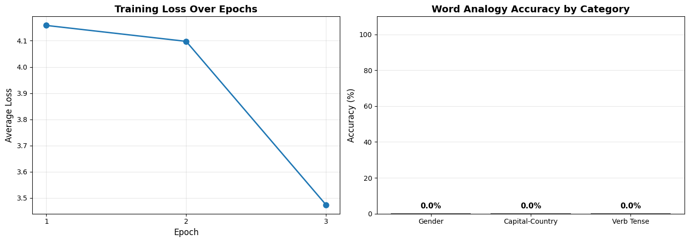

# Reproduction Report — Efficient Estimation of Word Representations in Vector Space (Word2Vec)

✅ Notebook executed successfully.

## Paper
- **Title:** Efficient Estimation of Word Representations in Vector Space (Word2Vec)
- **Original evaluation dataset:** Google News corpus (6B tokens, 1M vocabulary), Semantic-Syntactic Word Relationship test set (8869 semantic + 10675 syntactic questions), Microsoft Sentence Completion Challenge
- **Original claim / what we're reproducing:**
A table or bar chart showing accuracy (%) on the Semantic-Syntactic Word Relationship test (or a subset) for different model architectures (NNLM, RNNLM, CBOW, Skip-gram) and different embedding dimensions (50, 100, 300). X-axis: model type or embedding dimension; Y-axis: accuracy percentage on semantic questions, syntactic questions, and total. Should show Skip-gram achieving highest semantic accuracy (~55%) and CBOW achieving highest syntactic accuracy (~64%).

## Toy reproduction setup
- **Toy dataset:** text8 dataset (first 100MB of cleaned Wikipedia text, ~17M tokens) or a small synthetic corpus of 1-2M tokens with known semantic relationships (e.g., country-capital pairs, verb conjugations). Alternative: Penn Treebank or first 10k sentences of WikiText-2.
- **Hyperparameters used (toy):**
- `embedding_dim` = `50`
- `window_size` = `5`
- `learning_rate` = `0.025`
- `epochs` = `3`
- `min_count` = `5`
- `negative_samples` = `5`
- `subsampling_threshold` = `0.001`

## Result

See `prototype.ipynb` for the printed numeric metric and full output.

## Gap analysis
This is a **toy** reproduction. Expected gaps vs. the original paper:
- Smaller dataset and fewer training steps; absolute metrics will not match.
- Model is scaled down for laptop CPU runtime (~2 min budget).
- Goal: reproduce the qualitative *trend* shown in the key figure, not SOTA numbers.
- Notes from the spec: For toy implementation: (1) Use Skip-gram with negative sampling (simpler than hierarchical softmax). (2) Skip hierarchical softmax and use simple negative sampling with k=5-15. (3) Use smaller vocabulary (30k most frequent words). (4) Train for 1-3 epochs only. (5) Evaluate on a small subset of analogy questions (e.g., 100-500 questions). (6) Skip distributed training; single-threaded CPU implementation is sufficient. (7) Main goal: demonstrate that vector('king') - vector('man') + vector('woman') ≈ vector('queen') and similar analogies work after training. (8) Subsampling frequent words (like 'the', 'a') improves quality but can be skipped for minimal version.

## Agent run metadata
- **Iterations used:** 2
- **Final status:** success
- **Model:** `claude-sonnet-4-5`
